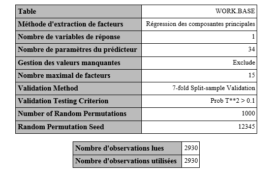
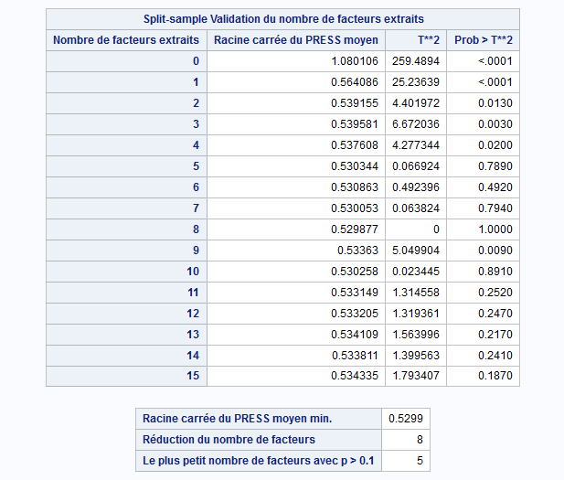
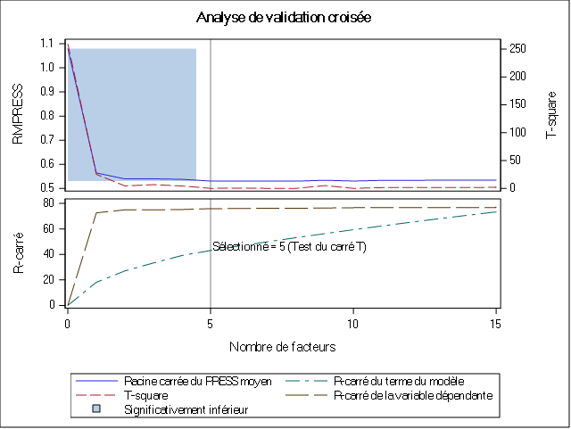
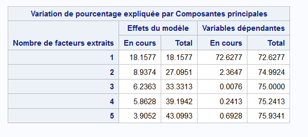

```{r message=FALSE, warning=FALSE, include=FALSE}
pkg <- c("tidyverse", "plsr", "caret", "pls", "recipes", "dplyr",
         "AmesHousing", "ggcorrplot", "factoextra", "hrbrthemes")

for (package in pkg){
  if (package %in% installed.packages()[, "Package"]){
  sapply(package, library, character.only = TRUE)
} else {
  install.packages(package)
  sapply(package, library, character.only = TRUE)
}
}

```

```{r echo=FALSE}
knitr::opts_chunk$set(dpi = 350, message = FALSE, 
                      warning = FALSE, echo = FALSE, 
                      fig.height = 8, fig.width = 8, dpi=300)
source("functions.R")
kable <- knitr::kable
```


# Introduction générale

L'estimation de la valeur d'un bien immobilier est une étape cruciale dans la vente du bien. L'économie de la décision a mis en exergue une opposition entre le comportement des acheteurs et celui des vendeurs de biens immobiliers. Dans un premier temps, les vendeurs de biens immobiliers ont tendance à surévaluer leurs propriétés pour des raisons personnelles (il peut s'agir d'une propriété familiale à laquelle le vendeur attache une valeur sentimentale) tandis que l'attitude des acheteurs est toute autre : les acheteurs ont tendance à fixer un prix de réserve bien souvent inférieur à la valeur à laquelle les propriétaires vendent le bien immobilier. Cette situation peut conduire à une inefficience du marché des biens immobiliers.  

Ce problèmpe d'inefficience est principalement due au différentiel d'estimation de la valeur que font les parties prenantes sur le marché. C'est pour cette raison que dans le cadre de cette étude, la question qui nous occupe est celle de comprendre les facteurs entrant dans la valorisation des biens immobiliers. Plus précisémenent il s'agit de se pencher sur les caractéristiques observables du bien qui entre positivement ou négativement dans la valeur du bien.  

Pour comprendre donc ces facteurs cette étude se base sur une historique des des ventes de propriétés résidentielles effectuées dans la ville de Ames dans l'Etat de l'Iowa aux Etats-Unis sur la période de 2006 à 2010.


> Mots clés : Econométrie, analyse exploratoire des données, analyses en composantes principales, régression


## Présentation des données

```{r}
ames <- AmesHousing::make_ames()
```

Le jeu de données sur lequel ce travail se base est décrit la vente de propriétés résidentielles individuelles à Ames, une ville de l'Etat de l'Iowa aux USA entre 2006 et 2010.
L'ensemble de données contient 2930 observations et 80 variables explicatives (23 nominales, 23 ordinales, 14 discrètes et 20 continues) impliquées dans l'évaluation de la valeur des propriétés résidentielles.


## Objectifs de l'étude

Bien que la motivation première de cette étude est celle de déterminer les facteurs entrant dans l'évaluation d'un bien immobilier, cette étude porte un grand intérêt à l'utilisation des méthodes économétriques d'estimation. Pour cette étude nous adoptons la démarche économétrique qui consiste à mettre en évidence les relations de causalité entre le prix auquel le bien immobilier est vendu et les caractéristiques de ce bien. Il ne s'agit pas seulement d'une analyse des corrélations, mais de déterminer aussi les causalités en hiérarchisant les effets des caractéristiques observables d'un bien immobilier sur son prix de vente et par cela identifier également les potentiels effets non observables.

## Plan de l'étude

Nous commencerons par faire des statistiques descriptives univariées des données. Dans cette partie nous cherchons à comprendre la distribution des variables que nous avons sélectionnées. Puis nous nous intéresserons aux statistiques bivariées en étudiant notamment les corrélations entre chaque paire de variables.

Après avoir fait les statistiques descriptives et bivariées nous chercherons à modéliser le prix de vente des biens immobiliers en passant en revue les différentes méthodes d'estimations économétriques.
Nous commencerons par utiliser la méthode des moindre carrés ordinaires. Nous ferons les différents tests et déterminer les éventuelles limites de cette méthode. Ensuite nous allons utiliser la méthode de régression sur composantes principales puis la méthode des moindres carrés partiels pour adresser les limites des moindres carrés ordinaires.

\pagebreak

# Analyse exploratoire des données

## Statistiques descriptives univariées

Nous allons afficher les statistiques descriptives des variables quantitatives continues présentes dans le jeu de données. Ces statistiques descriptives seront présentées sous formes d'un tableau à 5 colonnes qui affichent respectivement le minimum, la moyenne, l'écart-type, le maximum et la médiane.


```{r}
kable(statistiques_desc(subset(ames, select = -c(Longitude, Latitude))), 
      caption = "Tableau 1 : Statistiques descriptives sur les colonnes numériques")
```

En moyenne les maisons vendues coûtent un peu plus de 180 mille dollars. Les prix varient fortement d'une maison à l'autre puisque le prix minimum de vente est de 12789 dollars tandis que le prix maximum est de plus de 755 mille dollars.
Pour avoir une meilleure vision de la distribution des prix, nous pouvons représenter un histogramme des prix.

```{r fig.height=5, fig.width=8}
ggplot(data = ames, aes(x = Sale_Price)) +
  geom_histogram(bins = 50, color = "white") +
  labs(title = "Distribution du prix de vente des maisons") +
  theme_minimal() +
  theme(
    plot.title = element_text(face = "bold", size = 20)
  )
```

Nous pouvons également avoir un aperçu de l'ensemble des colonnes numériques du jeu de données en faisant une représentation graphique combinée de ces colonnes. 

```{r fig.height=10, fig.width=8}
num_columns <- ames[sapply(ames, is.numeric)]
num_columns %>%  subset(select = -c(Latitude, Longitude, Sale_Price)) %>% 
  mutate(id = "id") %>% reshape2::melt(id.var = "id") %>%
  ggplot(aes(x = value)) + geom_histogram(bins = 30, color = "white")  + 
  labs(x = NULL, y = NULL) + 
  facet_wrap(~variable, scale = "free", ncol = 4)
```


Il est important que nous explorions les données pour découvrir la structure des données. Le but de cette analyse exploratoire est d'étudier la variance associée au jeu de données. En effet une base de donnée comporte en elle une variance ou information et le but de tout travail économétrique consistant à modéliser la variable dépendante est de trouver un modèle qui arrive à expliquer la variance de cette variable dépendante en se basant sur des variables qu'on appelle variable explicatives.


## Statistiques descriptives bivariées

Les statistiques bivariées nous permettent d'observer le degré de liaisons entre les différentes variables. Nous allons nous intéresser au coefficient de corrélation pour chaque paire de variables afin de voir le degré de liaisons pour les variables prises deux à deux.  

Pour simplifier la lecture de ces paires de corrélation, nous allons représenter la matrice des paires de corrélation sous la forme d'un graphique. Cette façon nous permet de voir à la fois dans la globalité et pour chaque variable le degré de corrélation.

```{r}
corel <- cor(ames[sapply(ames, is.numeric)])
ggcorrplot(corel, hc.order = TRUE, 
           colors = c("red", "white", "darkgreen"),
           title = "Matrice des corrélations") + theme(
             legend.position = "top",
             legend.key.size = unit(3, "mm"),
             legend.box.spacing = unit(0.5, "mm"),
             legend.title = element_text("cor", size = 10),
             legend.key.width = unit(0.8, "cm"),
             plot.title = element_text(size = 20, face = "bold"),
             axis.text.x = element_text(size = 8),
             axis.text.y = element_text(size = 8)
             
           )
```

Nous voyons que sur un plan global les corrélations entre les variables sont davantage positives que négatives. Etant donné le grand nombre des variables que nous étudions, nous n'allons commenter que les coefficients de corrélation les plus fortes. 
Pour cela nous affichons dans les tableaux suivants les respectivement les plus fortes corrélations positives et les plus fortes corrélations négatives.


```{r}
corel.df <- data.frame(corel) %>%
  tibble::rownames_to_column("id") %>%
  reshape2::melt(id = "id") %>%
  arrange( -value) %>%
  filter(value <1)

colnames(corel.df) <- c("1", "2", "cor.coef")
idx <- 1:length(corel.df) %%2 == 0
kable(corel.df[idx, ] [1:10, ], caption = 
        "Les 10 premières fortes corrélations entre les variables")
```

La variable Garage_Cars mesure la taille du garage en capacité de voiture et la variable Garage_Area mesure la taille du garage en pieds carrés (mesure américaine). La corrélation entre ces deux variables est positive et très forte. 
La superficie totale en pieds carrés du sous-sol (Total_Bsmt_SF) est fortement corrélée avec la superficie du premier étage (First_Flr_SF).
Nous voyons également que la corrélation entre la superficie totale (Gr_Liv_Area) de la maison et son prix (Sale_Price) est également positive et forte.
Nous voyons également qu'il y a une corrélation positive entre le prix de la maison et la superficie totale du sous-sol. La superficie totale corrèle également positivement et fortement avec les salles de bain complètes au-dessus du niveau du sol (Full_Bath).


```{r}
corel.df <- data.frame(corel) %>%
  tibble::rownames_to_column("id") %>%
  reshape2::melt(id = "id") %>%
  arrange( value) %>%
  filter(value <1)

colnames(corel.df) <- c("1", "2", "cor.coef")
idx <- 1:length(corel.df) %%2 == 0
kable(corel.df[idx, ][1:10, ], caption = 
        "Les 10 premières fortes corrélations négatives entre les variables")
```

La lecture de ces corrélations nous montre certaines choses qu'on connaissait déjà à savoir par exemple que le prix d'une maison corrèle positivement avec sa superficie. Toutefois, étudier les paires de corrélations une à une peut être redondant du fait que plusieurs variables peuvent évoluer dans le même sens. Il serait donc plus intéressant de synthétiser les axes de variabilités qui existent entre les variables.  
Pour ce faire nous pouvons utiliser l'analyse en composante principale qui est une méthode factorielle permettant de résumer la matrice des variances-covariances.

## L'analyse en composantes principales

Le cercle de corrélation que nous contruisons ici est le résultat d'une analyse en composantes principales sur les données quantitatives. Par souci de simplicité nous ne représenterons que le premier plan factoriel.  
Ce premier plan factoriel comporte affiche la direction et la force de corrélation de chacunes des variables sur les deux premiers axes factoriels. En ACP le pouvoir explicatif des axes est déscendant, les deux premiers axes expliquent souvent une grande partie de la variance. 
L'intérêt de cette représentation est d'observer dans quel sens vont les corrélations et comment les variables peuvent être groupées sur les axes factoriels.

```{r}
base_finale <- cbind(num_columns, ames[, c("Overall_Qual", "Overall_Cond")])
base_finale$Overall_Cond <- as.character(base_finale$Overall_Cond)
base_finale$Overall_Qual <- as.character(base_finale$Overall_Qual)
# Transformer les variables overall_qual et overall_cond. Réduire le nombre de modalités

base_finale$Overall_Cond <- ifelse(base_finale$Overall_Cond %in% c("Very_Poor", "Poor", "Fair", "Below_Average"), "Low_Qual", base_finale$Overall_Cond)

base_finale$Overall_Cond <- ifelse(base_finale$Overall_Cond %in% c("Above_Average","Good", "Very_Good", "Excellent"), "Good-to-excellent", base_finale$Overall_Cond)

# Overall_Qual

base_finale$Overall_Qual <- ifelse(base_finale$Overall_Qual %in% c("Very_Poor", "Poor", "Fair", "Below_Average"), "Low_Qual", base_finale$Overall_Qual)

base_finale$Overall_Qual <- ifelse(base_finale$Overall_Qual %in% c("Above_Average","Good", "Very_Good", "Excellent"), "Good-to-excellent", base_finale$Overall_Qual)

base_finale$Overall_Cond <- as.factor(base_finale$Overall_Cond)
base_finale$Overall_Qual <- as.factor(base_finale$Overall_Qual)

base_finale <- base_finale %>%
  select(-c(Longitude, Latitude))
# EXPORT to csv for further processing with SAS
base_export <- base_finale %>%
  mutate(
    Overall_Cond = as.numeric(Overall_Cond),
    Overall_Qual = as.numeric(Overall_Qual)
  )

write.csv(x = base_export, file = "base_export.csv")
```


```{r fig.height=6, fig.width=6}
pc <- FactoMineR::PCA(subset(base_export, select = -Sale_Price), graph = FALSE)
```


```{r fig.height=7, fig.width=12}
fviz_eig(pc, main = "Pouvoir explicatif de chaque composante principale",
         addlabels = TRUE) +
  theme(plot.title = element_text(face = "bold", size = 20))
```

Le pouvoir explicatif marginal d'une composante est négative. Les deux premières composantes arrivent à expliquer 29,5% de la variance des caractéristiques des maisons.  

Nous pouvons représenter sur un plan factoriel les deux premières composantes principales pour observer le sens des variances.

```{r fig.height=15, fig.width=15}
fviz_pca_var(pc, repel = TRUE, 
             title = "Cercle des corrélations",
             ) + theme_ipsum() +
  theme(
    plot.title = element_text(size = 50, face = "bold")
  )
```

Pour avoir une meilleure idée de ce que représente chacun des axes, nous pouvons lister les contributions respectives des variables à la définition des axes.

```{r}
data.frame(pc$var$contrib[, 1:2]) %>%
  tibble::rownames_to_column(var = "Variable") %>%
  arrange(-Dim.1) %>% select(Variable, Dim.1) %>%
  slice(1:10) %>%
  kable(caption = "Les dix premières contributions à la première composante")
```

Les variables qui ont les plus fortes contributions sur le premier axe factoriel en dehors du prix sont principalement des variables qui touchent à la superficie de la maison ainsi que la superficie des pièces (Garages, salles de bain) que contient la maison. 
Cette composante désigne donc globalement la taille de la maison.

```{r}
data.frame(pc$var$contrib[, 1:2]) %>%
  tibble::rownames_to_column(var = "Variable") %>%
  arrange(-Dim.2) %>% select(Variable, Dim.2) %>%
  slice(1:10) %>%
  kable(caption = "Les dix premières contributions à la deuxièeme composante")
```

Sur la deuxième composante ce sont les caractéristiques relatives au nombre d'étages et de pièces situés


# Modélisations


## Transformations des données


Comme nous l'avions présenté dans la présentation des données, 46 des colonnes présentes dans le jeu de données ne sont pas quantitatives et continues. En effet 23 sont qualitatives ordinales et 23 autres sont qualitatives simples. Il est donc important que nous trouvions une stratégie pour inclure ces colonnes dans le modèle car ces informations qui ne sont pas nécessairement quantitatives sont importantes pour comprendre l'inertie de la variable que nous cherchons à modéliser qui est en l'occurence le prix du bien immobilier (`Sale_Price`).

Pour nous assurer de l'importance d'inclure les variables non quantitatives dans le modèle, nous allons construire deux modèles de regression multiples simples. Le premier modèle inclut uniquement les variables quantitatives continues et le second modèle va inclure en plus des variables quantitatives les variables qualitatives transformées.

## Modèle de régression multiple

```{r}
mod <- lm(Sale_Price~., data = base_export)
```


```{r comment=NA}
summary(mod)
```

La significativité globale de ce modèle de régression multiple est très bonne comme l'indique le test de Fisher. Le modèle explique 80% de la variance des prix de vente, ce qui est très bien pour des données transversales. La grande majorité des variables que nous avions sélectionnées pour inclure dans le modèle se sont montrés significatifs. Le test de Student effectué sur chacun des coefficients montre les différents dégrés de significativités des coefficients.  

A cause de multicolinéarité, la variable `Gr_Liv_Area` qui représente la surface habitable hors étage de la maison a été enlevée du modèle. 

Les variables sont toutes en niveau, nous pouvons donc interpréter les coefficients dans l'unité de la variable. Par exemple l'augmentation de la superficie du terrain (`Lot_Area`) d'un pied carré augmente le prix de la maison de 87.8 dollars, toute chose égale par ailleurs.

### Le test d'inflation de la variance (VIF)

Il n'est pas possible de réaliser le test d'inflation de la variance (*Variance Inflation Factor*) sur le modèle car le coefficient de la variable `Gr_Liv_Area` n'a pas été calculé à cause de la multicolinéaité. Pour pouvoir quantifier la multicolinéarité entre les variables, nous devons donc estimer un nouveau modèle dans lequel la variable `Gr_Liv_Area` est absente. 

Voici donc les résultats du test VIF que trouvons lorsque la variable `Gr_Liv_Area` est omise.

```{r comment=NA}
library(car)
mod2 <- lm(Sale_Price~., data = subset(base_export, select = -Gr_Liv_Area))
kable(sort(vif(mod2), decreasing = TRUE), col.names = "VIF",
      caption = "Test d'inflation de la variance (VIF)")
```

Puisqu'il n'y a aucune valeur VIF supérieure à 10, il est tentant d'affirmer qu'il n'y a pas de multicolinéarité. Car nous avons vu dans l'analyse des corrélations que certaines variables étaient fortement corrélées. Ainsi bien qu'il n'y a pas de relation linéaire exacte entre les variables, il existe des pseudo-colinéarités relativement fortes entre les variables. 

Nous pouvons vérifier les autres hypothèses des OLS pour déduire la colinéarité.


### Vérifions l'hypothèse de normalité des résidus

Nous pouvons représenter un histogramme de la distribution des résidus du modèle que nous venons d'estimer. L'une des hypothèses importantes des MCO est la normalité des résidus. Nous pouvons visuellement à l'aide de l'histogramme des résidus dire si les résidus suivent une loi normale.

```{r fig.height=4, fig.width=8}
ggplot() + aes(x = mod$residuals) + 
  geom_histogram(bins = 70, color = "white") + 
  theme_minimal() + 
  labs(title = "Histogramme des résidus", x= "Résidu") +
  theme(plot.title = element_text(face = "bold", size = 20))

```
A l'aide de l'histogramme nous observons que la distribution ressemble à une loi normale, mais elle est fortement dirigée vers la droite. 
Nous pouvons faire le test de Shapiro-Wilk pour tester plus formellement la normalité des résidus. L'hypothèse nulle de ce test est que la distribution est normalement distribuée.

```{r comment=NA}
shapiro.test(mod$residuals)
```

Ici la p-value est inférieure à 5% donc, nous rejettons cette hypothèse nulle, la distribution ne suit pas une loi normale.

Dès lors que les résidus ne suivent pas une loi normale, les estimations faites par les OLS sont biaisées. Il importe donc d'utiliser d'autres méthodes d'estimations pour construire le modèle.

## Régressions sur variables latentes

### Pourquoi faire une régression sur les variables latentes ?

Les méthodes de régressions sur les latentes nous permettent d'adresser certaines limites que posent les méthodes de régression sur les moindres carrés. En effet pour qu'une régression par les OLS soit sans biais il faut que les hypothèses posées par les OLS soit vérifiées. Parmi ces hypothèses nous pouvons citer l'absence de corrélations entre les variables et l'absence de multicolinéarité entre les variables.

Or en général les phénomènes que nous cherchons à expliquer, ici le prix de vente du bien immobilier, ne vérifient pas toujours ces hypothèses à cause entre autres de la non indépendance des phénomènes. Cette situation nous amène à des résultats potentiellement biasés et non généralisables pour expliquer le phénomène.
La méthode de régression sur les variables nous permettent donc de corriger ces limites des régression standards en créant des variables synthétiques sur lesquelles nous allons faire les estimations.
Les variables synthétiques créées lors de l'estimation présentent une propriété très intéressante qui est celle de l'orthogonalité. En effet les variables synthétiques ou les composantes ne sont pas corrélées entre elles-mêmes, ce faisant nous pouvons entièrement faire des régressions en vérifiant les hypothèses des OLS standards.

Pour mettre en place ces méthodes, nous allons utiliser la procédure PLS implémentée dans le logiciel SAS.  

Les techniques mises en œuvre par la procédure PLS sont les suivantes:  

- La régression sur composantes principales, qui extrait des facteurs qui expliquent le plus la variance des variables explicatives.  

- La régression de rang réduit, qui extrait des facteurs qui expliquent le plus la variation de la variable réponse (y). Cette technique, également appelée analyse de redondance (maximale), diffère de la régression linéaire multivariée uniquement lorsqu'il y a plusieurs réponses.  

- La régression sur les moindres carrés partiels, qui équilibre les deux objectifs d’explication de la variation de la réponse et expliquant la variation des prédicteurs. Deux formulations différentes pour les moindres carrés partiels sont disponibles:
la méthode prédictive originale de Wold (1966) et la méthode SIMPLS de de Jong (1993).

En raison du fait que nous ne cherchons ici qu'à expliquer une seule variable (y), à savoir le prix des maisons, nous n'utiliserons pas la régression sur rang réduit.

## Régréssion sur composantes principales

La méthode de régression sur composantes principales consiste à effectuer une régression linéaire simple ou multiple sur les coordonnées des individus projetés dans un plan factoriel à k dimensions avec k strictement plus petit que le nombre de variables initial.

Pour cette méthode, nous allons utiliser conjointement SAS et R.

## Résultats d'estimations avec SAS






Pour pouvoir déterminer avec confiance le nombre de composantes principales (ou facteurs) à retenir dans la PCR, l'algorithme utilise une technique de validation croisée. Une technique de validation croisée consiste à diviser l'échantillon en plusieurs groupes sur lesquels des ajustements successifs sont effectués. L'ajustement du modèle est effectué sur le groupe d'apprentissage et les résultats sont comparés aux observations du groupe test. L'efficaité prédictive est évaluée à l'aide l'indicateur PRESS (Predicted REsidual Sum of Squares).
Le tableau suivant nous montre que la valeur minimale de la validation croisée est atteinte si le nombre de composantes principales est 8. Toutefois il est préférable de se fier au test qui indique si oui ou non il existe une différence significative entre les 8 composantes.  
Le test nous indique qu'à partir de la 4e composante il n'existe plus de différences significatives entre les composantes. Nous allons donc retenir 5 composantes pour la suite de l'analyse. 




Il convient maintenant d'interpréter les résultats du modèle construit. 
Le tableau suivant affiche la variation de pourcentage expliquée par composantes principales



Le tableau affiche deux catégories de résultats : la variation de pourcentage expliquée par composantes principales sur les effets du modèle et sur la variable dépendante.
Les effets du modèle représentent les variables explicatives tandis que la variable dépendante est le prix de la maison que nous cherchons à expliquer.

Nous voyons donc que pour les 5 composantes retenues, la régression sur les composantes principales explique près de 76% de la variable dépendante et environ 43% des variables explicatives.

Nous pouvons à partir d'ici utiliser R pour trouver les coefficients associés à chaque facteur extrait. 

```{r comment=NA}
pc2 <- FactoMineR::PCA(subset(base_export, 
                             select = -c(Sale_Price)), 
                       graph = FALSE)

coord_pc <- data.frame(pc2$ind$coord)
coord_pc$Sale_Price <- ames$Sale_Price
mod_pc <- lm(Sale_Price~., data = coord_pc)
summary(mod_pc)
```

Les résultats globaux du modèle que nous trouvons sont les mêmes avec R. Les 5 composantes retenues expliquent bien 75,93% de la variance des prix de vente de la maison.


### Régéressions sur les moindres carrés partiels


\pagebreak


# Comparaison des performances des différentes méthodes d'estimation


# Bibliographie

Alboukadel Kassambara and Fabian Mundt (2019). factoextra: Extract and
  Visualize the Results of Multivariate Data Analyses. R package version
  1.0.6. http://www.sthda.com/english/rpkgs/factoextra
  
Bjørn-Helge Mevik, Ron Wehrens and Kristian Hovde Liland (2019). pls: Partial Least Squares and Principal
  Component Regression. http://mevik.net/work/software/pls.html, https://github.com/bhmevik/pls.

Dean de Cook, Ames, Iowa: Alternative to the Boston Housing Data as an
End of Semester Regression Project. *Journal of Statistics Education Volume 19, Number 3(2011)*

Jan Niklas Schneider and Timothy Raymond Brick (2019). plsr: Pleasure -
  Partial Least Squares Analysis with Permutation Testing. R package
  version 0.0.1.

Max Kuhn (2017). AmesHousing: The Ames Iowa Housing Data. R package
  version 0.0.3.
The PLS Procedure, SAS/STAT® 13.1 User’s Guide https://support.sas.com/documentation/onlinedoc/stat/131/pls.pdf


\pagebreak

# Annexes

## Annexe 1 : Liste exhaustive des colonnes 

Le jeu de données contient initialement 81 colonnes

```{r}
kable(
  data.frame(
    Colonnes = colnames(ames)[0:20],
    ".." = colnames(ames)[21:40],
    "..." = colnames(ames)[41:60],
    "...." = colnames(ames)[61:80]
    ))
```

Description des colonnes :


SalePrice - the property's sale price in dollars. This is the target variable that you're trying to predict.  

MSSubClass: The building class  
MSZoning: The general zoning classification  
LotFrontage: Linear feet of street connected to property  
LotArea: Lot size in square feet  
Street: Type of road access  
Alley: Type of alley access  
LotShape: General shape of property  
LandContour: Flatness of the property  
Utilities: Type of utilities available  
LotConfig: Lot configuration  
LandSlope: Slope of property  
Neighborhood: Physical locations within Ames city limits  
Condition1: Proximity to main road or railroad  
Condition2: Proximity to main road or railroad (if a second is present)  
BldgType: Type of dwelling  
HouseStyle: Style of dwelling  
OverallQual: Overall material and finish quality  
OverallCond: Overall condition rating  
YearBuilt: Original construction date  
YearRemodAdd: Remodel date  
RoofStyle: Type of roof  
RoofMatl: Roof material  
Exterior1st: Exterior covering on house  
Exterior2nd: Exterior covering on house (if more than one material)  
MasVnrType: Masonry veneer type  
MasVnrArea: Masonry veneer area in square feet  
ExterQual: Exterior material quality  
ExterCond: Present condition of the material on the exterior  
Foundation: Type of foundation  
BsmtQual: Height of the basement  
BsmtCond: General condition of the basement  
BsmtExposure: Walkout or garden level basement walls  
BsmtFinType1: Quality of basement finished area  
BsmtFinSF1: Type 1 finished square feet  
BsmtFinType2: Quality of second finished area (if present)  
BsmtFinSF2: Type 2 finished square feet  
BsmtUnfSF: Unfinished square feet of basement area  
TotalBsmtSF: Total square feet of basement area  
Heating: Type of heating  
HeatingQC: Heating quality and condition  
CentralAir: Central air conditioning  
Electrical: Electrical system  
1stFlrSF: First Floor square feet  
2ndFlrSF: Second floor square feet  
LowQualFinSF: Low quality finished square feet (all floors)  
GrLivArea: Above grade (ground) living area square feet  
BsmtFullBath: Basement full bathrooms  
BsmtHalfBath: Basement half bathrooms  
FullBath: Full bathrooms above grade  
HalfBath: Half baths above grade  
Bedroom: Number of bedrooms above basement level  
Kitchen: Number of kitchens  
KitchenQual: Kitchen quality  
TotRmsAbvGrd: Total rooms above grade (does not include bathrooms)  
Functional: Home functionality rating  
Fireplaces: Number of fireplaces  
FireplaceQu: Fireplace quality  
GarageType: Garage location  
GarageYrBlt: Year garage was built  
GarageFinish: Interior finish of the garage  
GarageCars: Size of garage in car capacity  
GarageArea: Size of garage in square feet  
GarageQual: Garage quality  
GarageCond: Garage condition  
PavedDrive: Paved driveway  
WoodDeckSF: Wood deck area in square feet  
OpenPorchSF: Open porch area in square feet  
EnclosedPorch: Enclosed porch area in square feet  
3SsnPorch: Three season porch area in square feet  
ScreenPorch: Screen porch area in square feet  
PoolArea: Pool area in square feet  
PoolQC: Pool quality  
Fence: Fence quality  
MiscFeature: Miscellaneous feature not covered in other categories  
MiscVal: $Value of miscellaneous feature  
MoSold: Month Sold  
YrSold: Year Sold  
SaleType: Type of sale  
SaleCondition: Condition of sale  


Présenter le sujet : 
- Statistiques descriptives univariées (variable par variable)
- Répondre à une question ou une série de questions
- Présenter les statistiques bivariées : corrélation , test du khi-deux
- ACP au préalable
Comparer les résultats des différentes méthodes :
- dire pourquoi utiliser chacune des méthode : pourquoi une OLS, pourquoi une PCR, PLS.
- Dire quel résultat auquel on s'attend

Présenter uniquement les tableaux de résultats principaux et les graphique. Mettre ce qui est moins pertinent en annexes. Commenter les résultats

Conclure : analyser les résultats et les comparer à ce qu'on avait dit au début
Quels résultats ces méthodes apportent?
- 
